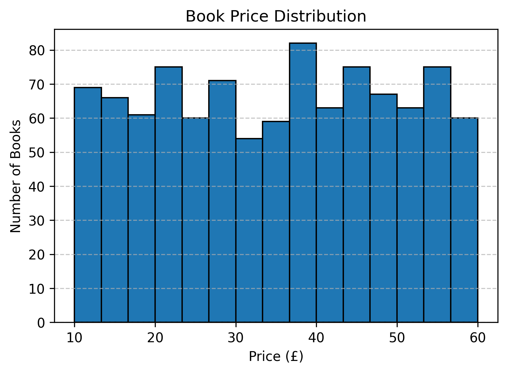
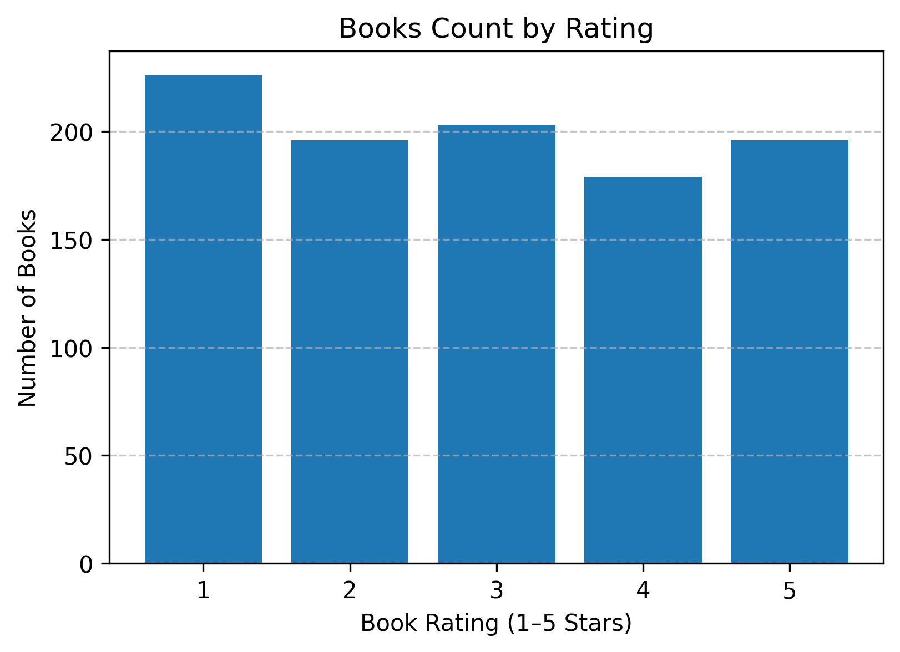
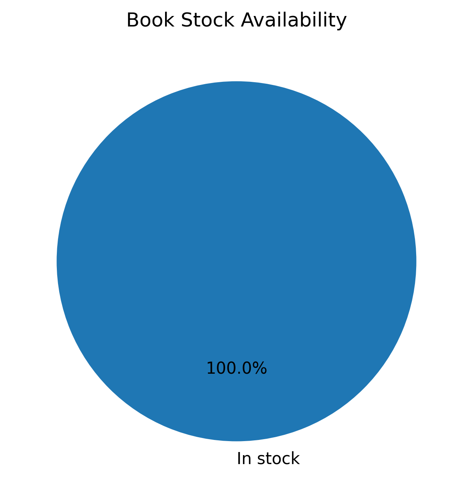

# Book Price Tracker

A Python project to scrape **book titles, prices, stock availability, and ratings** from an online bookstore, export data to Excel, and generate visualizations.

---

## 🔹 Features
- Scrapes book **titles, prices, stock, and ratings**
- Exports data to Excel (`data/books_data.xlsx`)
- Generates visualizations (`images/` folder)

---

## Folder Structure

BookPriceTracker/
├─ data/          # Excel outputs
├─ images/        # Visualizations
├─ scripts/       # Python scripts
├─ README.md
├─ LICENSE
├─ requirements.txt
└─ .gitignore

---

## 📊 Sample Output

Here’s an example of the data scraped from **Books to Scrape**:

|| Title | Price | Stock | Rating |
|--------|--------|----------|--------|
| It's Only the Himalayas | £45.17 | In stock | 2 |
| Full Moon over Noah’s Ark | £49.43 | In stock | 4 |
| The Requiem Red | £22.65 | Out of stock | 1 |
| The Dirty Little Secrets of Getting Your Dream Job | £33.34 | In stock | 3 |
| The Coming Woman: A Novel | £17.93 | In stock | 5 |


You can also download the full Excel file here:
➡️ [books_data.xlsx](data/books_data.xlsx)


---

## 📊 Demo
If you have generated plots, add them here :




---

## ⚡ How to Run
```bash
pip install -r requirements.txt
python scripts/scrape_books.py
python scripts/visualize.py

---

## 💻 Tech Stack
- Python
- BeautifulSoup
- Requests
- Pandas
- Matplotlib
- Openpyxl
- Excel

---

## License
This project is licensed under the MIT License - see LICENSE file for details.


